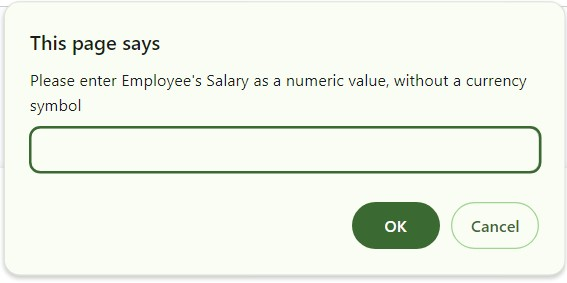
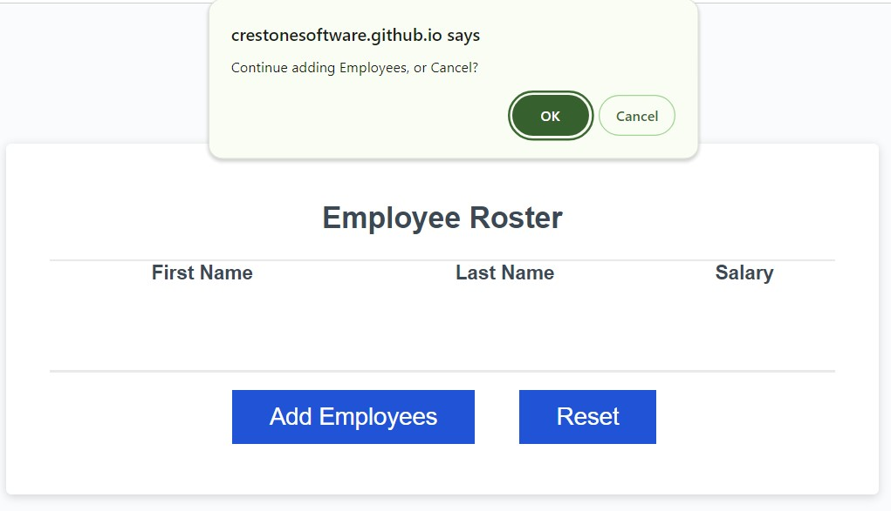

# Payrolleo - Employee Payroll Tracker

## Description
This release implements a prototype of the Payrolleo Employee Payroll Tracker application. The application enables a payroll manager to enter and view employee payroll data. The previous release provided a utilitarian UI, responsive to changes in size and devices.

## In this Release
This release adds features satisfying the following success criteria:

GIVEN the Payrolleo application
- WHEN I click the "Add employee" button

  THEN I am presented with a series of prompts asking for first name, last name, and salary

- 	WHEN I finish adding an employees

	THEN I am prompted to continue or cancel

- WHEN I choose to continue

	THEN I am prompted to add a new employee

- WHEN I choose to cancel

	THEN my employee data is displayed on the page sorted alphabetically by last name, and the console shows computed and aggregated data

- WHEN I open a browser to the URL provided below

	THEN I find the Payrolleo application, deployed via Git Pages

### Bonus Features
This release includes three bonus features, not requested by the product owner. They are submitted for consideration as product improvements:

GIVEN I am adding Employee Data
- When I enter a non-numeric value

	THEN I am prompted to "Please enter Employee Salary as a decimal value, without a currency symbol"

GIVEN Employee data is present in the Employee Roster table
- WHEN I click the Add Employees button and enter employee data

	THEN The new employees are added to the roster
- WHEN I click the Reset button

	THEN Existing employee data is deleted and I am prompted to enter new data

## Installation
N/A

## Usage
Open [the deployed application](https://crestonesoftware.github.io/payrolleo/)

### Add Employees
1) Click [Add Employees]
2) Follow prompts to enter employee's First Name, Last Name and Salary
3) Click [OK] to add more employees or [Cancel] to end data entry. 

Result: employee data are inserted/appended to the Employee Roster table.

### View Computed and Aggregated Data
4) Open the Inspector feature of your browser. For instance, in Chrome, press [CTRL + Shift + i]
5) Chose the Console view
6) Review computed and aggregated data in the Console

### Reset
Given: Employee Roster Table contains data
- Click [Reset]

Result: 
- the table is cleared
- the data entry workflow begins as in 1) under Add Employees

## Credits
N/A
